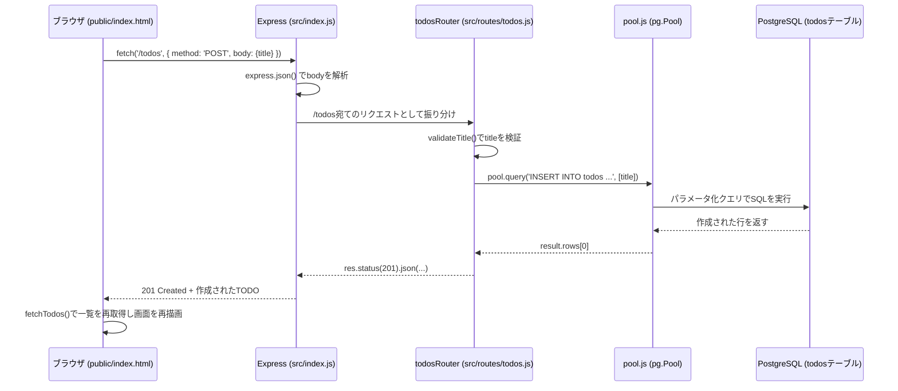

# アーキテクチャドキュメント

## 1. システム概要

Node.js + Express で構築したシンプルなTODO管理アプリケーション。ブラウザから、TODOの追加・一覧表示・完了/未完了の切り替え・削除ができる。データはPostgreSQLに永続化され、ブラウザを閉じても消えない。

バックエンド（Express）がREST API（`/todos`配下）を提供し、フロントエンド（素のHTML/CSS/JS）がその場でAPIを`fetch`で呼び出して画面を描画する、シンプルな構成。

## 2. 技術スタック一覧

| 分類 | 技術 | 採用理由 |
| --- | --- | --- |
| バックエンド言語/実行環境 | Node.js | フロントエンドと同じJavaScriptで書け、学習コストが低い |
| バックエンドフレームワーク | Express | 最小限の機能に絞られたシンプルなフレームワークで、小規模なAPIに適している |
| DBドライバ | pg (node-postgres) | Node.jsからPostgreSQLに接続するための標準的なライブラリ。コネクションプール（`Pool`）を提供する |
| データベース | PostgreSQL | 無料で使えるOSSのRDBMS。TODOのような構造化データの永続化に適している |
| 環境変数管理 | dotenv | `.env`ファイルからDB接続情報などを読み込み、秘密情報をコードから分離するため |
| フロントエンド | 素のHTML/CSS/JavaScript | 画面構成がシンプルなため、React等のフレームワークを使わずfetch APIのみで完結させている |
| テストフレームワーク | Jest | バックエンド・フロントエンド両方のテストを1つの設定でまとめて実行できる |
| APIテスト補助 | supertest | Expressのルートに対して、実際にHTTPリクエストを送るのと同じ形でテストできる |
| フロントエンドテスト環境 | jsdom | ブラウザが無い環境でも、DOM操作を含むフロントエンドのコードをテストできる |
| ローカルDB環境 | Docker Compose | 開発者ごとにPostgreSQLを個別インストールしなくても、コマンド1つで同じDB環境を再現できる |
| CI/CD | GitHub Actions | pushのたびに自動でテストを実行し（`ci.yml`）、mainブランチへのpush時に自動でEC2へデプロイする（`deploy.yml`） |
| プロセス管理（本番） | pm2 | EC2上でExpressサーバーをバックグラウンドで起動・自動再起動させるため |

## 3. ディレクトリ構成と各ファイルの役割

```text
my-cloud-project/
├── .github/workflows/
│   ├── ci.yml                  # push/PR時にテストを自動実行するワークフロー
│   ├── deploy.yml              # mainブランチへのpush時に、テスト成功を条件にEC2へ自動デプロイするワークフロー
│   ├── claude.yml              # Claude PR Assistant用ワークフロー
│   └── claude-code-review.yml  # Claude Code Review用ワークフロー
├── .claude/commands/            # Claude Code用のカスタムスラッシュコマンド定義
│   ├── db-check.md              # DB接続・todosテーブルの状態確認
│   ├── deploy-check.md          # デプロイ前の最終チェック（テスト・カバレッジ含む）
│   ├── test-coverage.md         # カバレッジ計測と改善提案
│   └── test-fix.md              # テスト失敗の自動修正
├── db/migrations/
│   └── 001_create_todos.sql     # todosテーブルを作成するマイグレーションSQL
├── scripts/
│   ├── migrate.js               # db/migrations配下のSQLを番号順に実行するスクリプト
│   └── check-db.js              # DBへの接続確認とtodosテーブルの状態（件数など）を表示するスクリプト
├── src/
│   ├── index.js                 # Expressサーバーのエントリーポイント（ミドルウェア登録・起動）
│   ├── db/
│   │   └── pool.js              # PostgreSQL接続プール（pg.Poolのインスタンス）
│   └── routes/
│       └── todos.js             # TODOのCRUD APIルート（GET/POST/PATCH/DELETE）
├── public/
│   └── index.html               # 操作画面一式（HTML/CSS/JS）。fetchでAPIを呼び出す
├── __tests__/
│   ├── routes/todos.test.js     # todos.jsのユニットテスト（DBはjest.mockでモック）
│   └── frontend/todo.test.js    # public/index.htmlのフロントエンドロジックのテスト
├── docs/
│   ├── architecture.md          # 本ドキュメント
│   └── tasklog.md               # 作業内容を時系列で記録したログ
├── docker-compose.yml           # ローカル開発用PostgreSQLコンテナの定義
├── jest.config.js               # Jestの設定（バックエンド/フロントエンドでプロジェクトを分割、カバレッジ設定）
├── jest.setup.js                # フロントエンド（jsdom）テスト用のセットアップ
├── .env.example                 # 環境変数のテンプレート（実際の値は.envに書く。.envはGit管理外）
├── package.json                 # 依存関係とnpmスクリプトの定義
└── CLAUDE.md                    # このリポジトリでのコーディング規約
```

## 4. データフロー図

ブラウザでの操作から、DBへの反映までの流れ。



補足：`express.static`によるHTML配信（画面を開いたときの流れ）は上記とは別経路で、`GET /`へのリクエストに対して`public/index.html`をそのまま返す（DBへは一切アクセスしない）。

## 5. APIエンドポイント一覧

| メソッド | パス | リクエスト | レスポンス（成功時） | レスポンス（主な失敗時） |
| --- | --- | --- | --- | --- |
| GET | `/todos` | クエリ: `?completed=true\|false`（省略可） | `200` TODOの配列 | `400` completedの値が不正 |
| GET | `/todos/:id` | なし | `200` TODO1件のオブジェクト | `404` idが数値以外、または存在しない |
| POST | `/todos` | `{ "title": string }` | `201` 作成されたTODOオブジェクト | `400` titleが空文字/255文字超過/型不正 |
| PATCH | `/todos/:id` | `{ "title"?: string, "completed"?: boolean }`（どちらか一方または両方） | `200` 更新後のTODOオブジェクト | `400` 値が不正／`404` idが存在しない |
| DELETE | `/todos/:id` | なし | `204` No Content（bodyなし） | `404` idが存在しない |

共通仕様：
- `title`は必須・空文字不可（前後の空白はtrim）・255文字以内
- `completed`はboolean型のみ許可
- `:id`は数値形式の文字列のみ許可（数値以外は404）
- DB接続エラーなど予期しない例外は、全エンドポイントで`500`を返す

## 6. データベーススキーマ

`db/migrations/001_create_todos.sql`で定義している`todos`テーブル。

```sql
CREATE TABLE IF NOT EXISTS todos (
  id BIGSERIAL PRIMARY KEY,
  title TEXT NOT NULL,
  completed BOOLEAN NOT NULL DEFAULT false,
  created_at TIMESTAMPTZ NOT NULL DEFAULT now(),
  updated_at TIMESTAMPTZ NOT NULL DEFAULT now()
);
```

| カラム名 | 型 | 意味 |
| --- | --- | --- |
| `id` | BIGSERIAL PRIMARY KEY | 自動採番される、他と重複しない一意の識別子。1件ずつを区別するために使う（`WHERE id = $1`等） |
| `title` | TEXT NOT NULL | TODOのタイトル。空（NULL）での保存を許さない |
| `completed` | BOOLEAN NOT NULL DEFAULT false | 完了/未完了の状態。値を指定しなければ自動で`false`（未完了）になる |
| `created_at` | TIMESTAMPTZ NOT NULL DEFAULT now() | 行が作成された日時。以降変更されない |
| `updated_at` | TIMESTAMPTZ NOT NULL DEFAULT now() | 最後に更新された日時。`PATCH`実行のたびに`now()`で上書きされる |

## 7. 環境変数一覧

`.env.example`をコピーして`.env`を作成し、値を設定する（`.env`自体は`.gitignore`によりGit管理外）。

| 変数名 | 説明 | 例（ローカル開発時） |
| --- | --- | --- |
| `PORT` | Expressサーバーが待ち受けるポート番号 | `3000` |
| `DB_HOST` | PostgreSQLのホスト名 | `localhost` |
| `DB_PORT` | PostgreSQLのポート番号（`docker-compose.yml`のポートマッピングと一致させる） | `5433` |
| `DB_USER` | PostgreSQL接続用のユーザー名 | `todo_user` |
| `DB_PASSWORD` | PostgreSQL接続用のパスワード（機密情報。他人に知られるとDBに直接ログインされてしまう） | `todo_password` |
| `DB_NAME` | 接続先のデータベース名 | `todo_app` |

デプロイ時（GitHub Actions経由）は、これらに加えて`EC2_HOST`・`EC2_USER`・`EC2_KEY`（EC2接続用SSH秘密鍵）をGitHub Secretsとして登録する。

## 8. ローカル開発の起動手順

```bash
# 1. 依存パッケージをインストール
npm install

# 2. 環境変数ファイルを作成（未作成の場合。既定値のままローカル開発で利用可能）
cp .env.example .env

# 3. PostgreSQLコンテナを起動
docker compose up -d

# 4. todosテーブルを作成（マイグレーション実行）
npm run db:migrate

# 5. サーバーを起動
npm start
```

起動後、ブラウザで <http://localhost:3000> を開くとTODO画面が表示される。

テストを実行する場合：

```bash
npm test           # 全テスト実行
npm run test:coverage  # カバレッジ計測付きで実行
```
